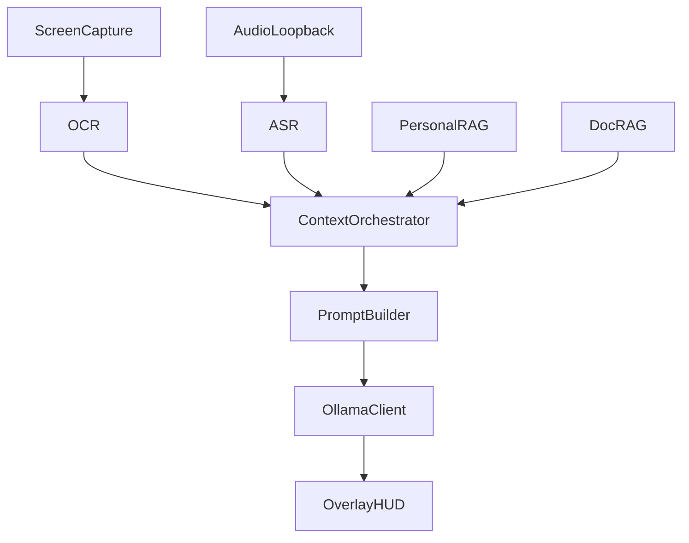

# Architecture

## Layers

| Layer | Project | Responsibility |
|-------|---------|----------------|
| UI | Readscreen.App, Readscreen.Overlay | Settings, memory editor, HUD |
| Brain | Readscreen.Core | ContextOrchestrator, PromptBuilder |
| Perception | Readscreen.Perception | Screen OCR, audio loopback, ASR |
| Memory | Readscreen.Memory | SQLite vector stores, document ingest |
| LLM | Readscreen.Llm | Ollama HTTP streaming client |

## Data Flow

1. **ScreenMonitorWorker** polls capture region every N seconds
2. **OcrService** extracts text; **ChangeDetector** deduplicates
3. **ContextOrchestrator** retrieves RAG context and calls Ollama
4. Tokens stream to **OverlayService** in real time
5. **AudioMonitorWorker** parallel path for meeting transcription

## Local Storage

- `%AppData%/Readscreen/memory.db` — personal memory + embeddings
- `%AppData%/Readscreen/documents.db` — document chunks + embeddings
- `%AppData%/Readscreen/logs/` — Serilog rolling files
